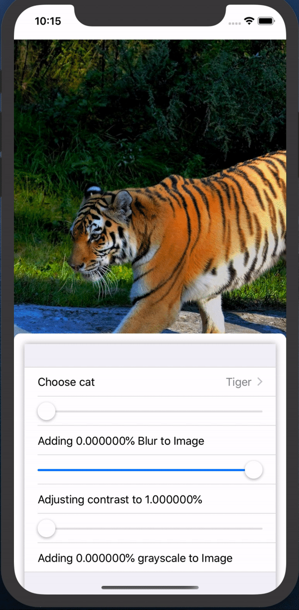

# SwiftUI Image modifiers

A sample app showing how to dynamically apply image modifiers

In this example we are using the following Swift UI components:
  - NavigationView
  - ZStack
  - Image
  - Form
  - Picker
  - Slider
  
  
